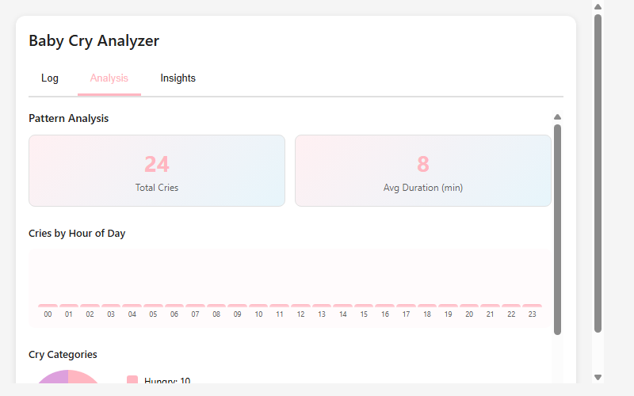
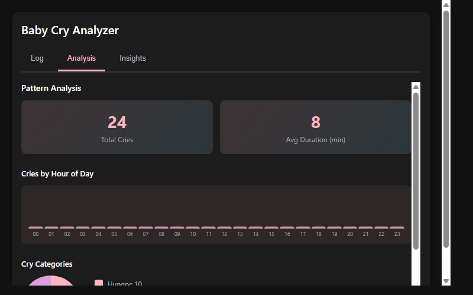

# Home Assistant Cry Analyzer

[](https://github.com/MacSiem/ha-cry-analyzer/actions/workflows/validate.yml)
[](https://github.com/hacs/integration)

A Lovelace card for Home Assistant that helps caregivers track, analyze, and understand baby cry patterns. Log cry episodes with intensity and duration, identify trends, and receive personalized insights.



## Features

- Log cry episodes with category, intensity, and duration
- Track patterns by hour of day (hourly frequency chart)
- Categorize cries (hungry, tired, pain, discomfort, bored, unknown)
- Visualize cry categories with pie chart
- Analyze average cry duration
- AI-powered insights & tips based on patterns
- Identify peak cry times and common categories
- Export cry logs to JSON for backup or sharing
- Light and dark theme support
- Responsive design for mobile and desktop

## Installation

### HACS (Recommended)

1. Open HACS in your Home Assistant
2. Go to Frontend → Explore & Download Repositories
3. Search for "Cry Analyzer"
4. Click Download

### Manual

1. Download `ha-cry-analyzer.js` from the [latest release](https://github.com/MacSiem/ha-cry-analyzer/releases/latest)
2. Copy it to `/config/www/ha-cry-analyzer.js`
3. Add the resource in Settings → Dashboards → Resources:
   - URL: `/local/ha-cry-analyzer.js`
   - Type: JavaScript Module

## Usage

Add the card to your dashboard:

```yaml
type: custom:ha-cry-analyzer
title: Baby Cry Analyzer
sound_sensor: binary_sensor.nursery_sound
```

### Configuration

| Option | Type | Default | Description |
|--------|------|---------|-------------|
| `title` | string | `Baby Cry Analyzer` | Card title |
| `sound_sensor` | string | (optional) | Entity ID of sound sensor for automation integration |

## Tabs

### Log Tab
- View all recorded cry episodes
- Add new cry entries with category and notes
- Delete individual entries
- Displays episodes in reverse chronological order with timestamps

### Analysis Tab
- View total cry count
- See average cry duration
- Hourly frequency chart showing which hours have the most crying
- Pie chart displaying cry category distribution

### Insights Tab
- AI-generated tips based on your data
- Pattern detection (peak hours, dominant categories)
- Duration warnings and sleep/feeding recommendations
- Personalized guidance for soothing strategies

## Screenshots

| Light Theme | Dark Theme |
|:-----------:|:----------:|
|  |  |

## Data

All cry logs are stored locally in the card's state. You can export them at any time using the "Export to JSON" button. No data is sent to external services.

## Tips for Best Results

- Log cries consistently to build accurate pattern analysis
- Use specific categories when possible (hungry, tired, etc.)
- Rate intensity on a 1-5 scale
- Add notes about what worked to soothe the baby
- Check insights regularly to identify trends
- Use exported JSON to share data with pediatricians or caregivers

## License

MIT License - see [LICENSE](LICENSE) file.
