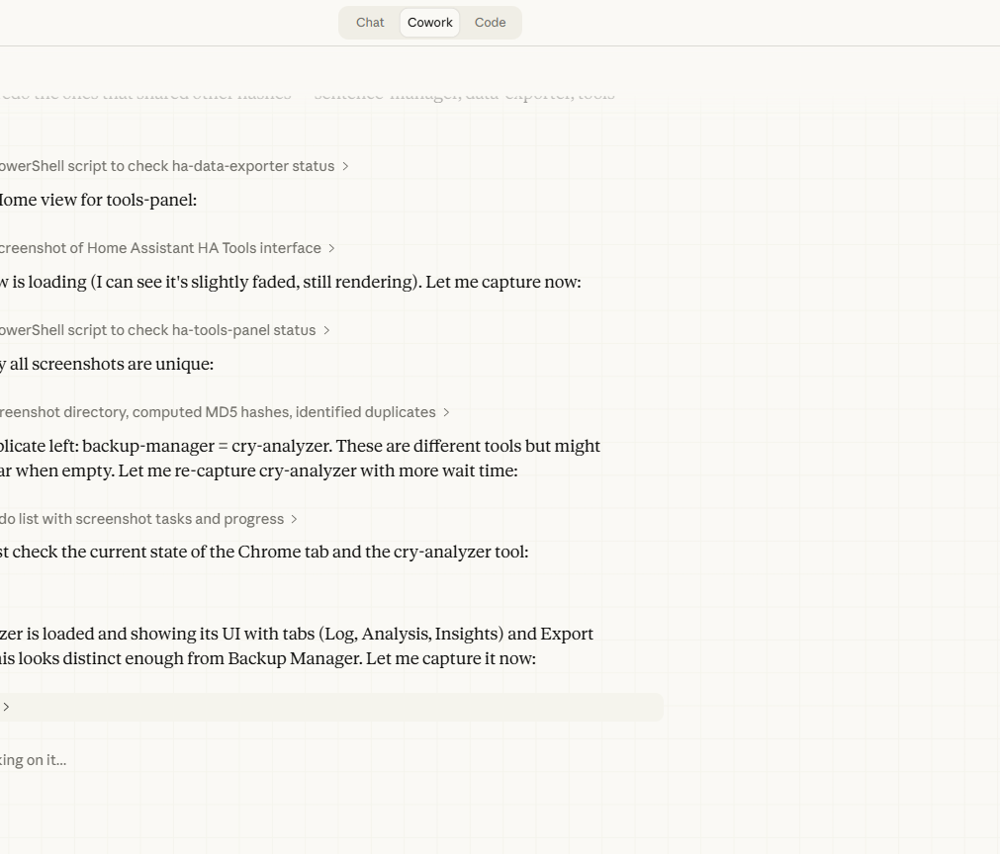

# 👶 Cry Analyzer

Local baby-cry logging with deterministic pattern summaries and practical tips.

Part of the [HA Tools](https://github.com/MacSiem/ha-tools-panel) collection for Home Assistant.

## Installation

### HACS (recommended)
1. Add `https://github.com/MacSiem/ha-cry-analyzer` as a Dashboard custom repository in HACS.
2. Search for **Cry Analyzer** and install it.
3. Refresh the browser and add `type: custom:ha-cry-analyzer` to a dashboard.

### Manual
1. Download `ha-cry-analyzer.js` from this repository
2. Copy to `/config/www/community/ha-cry-analyzer/`
3. Add as a Lovelace resource

## Screenshot

## Changelog

### v3.1.2 (2026-08-28)
- Escapes persisted notes, categories, titles, and attributes before HTML rendering.
- Validates restored local data and clamps numeric fields.
- Replaced stringified handlers and `eval` with explicit `data-action` event routing.
- Fixed render-throttle cleanup when the card is removed.

### v2.3 (2026-03-17)
- Bento Light Mode UI redesign (Inter font, blue accent #3B82F6)
- Throttled hass updates (5s) to prevent UI lag
- Stable pagination and data persistence
- Fixed dual-script loading (customElements.define guard)
- CSS custom properties for theming (--bento-primary, --bento-bg, etc.)
- Improved readability and layout consistency

## License

MIT
